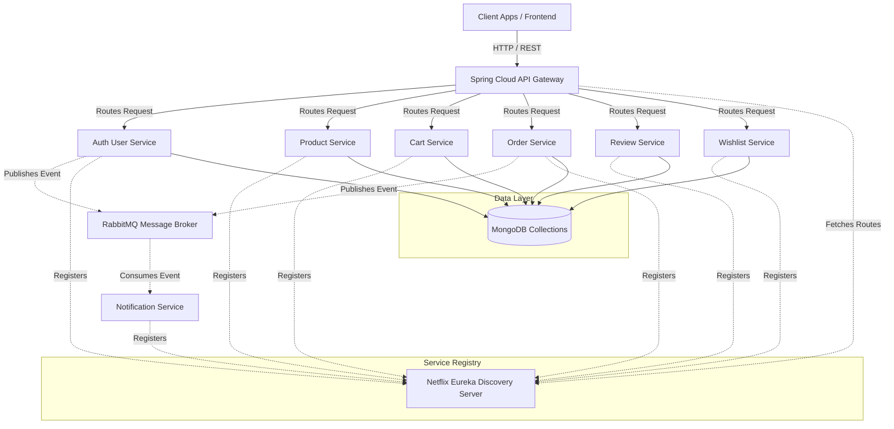
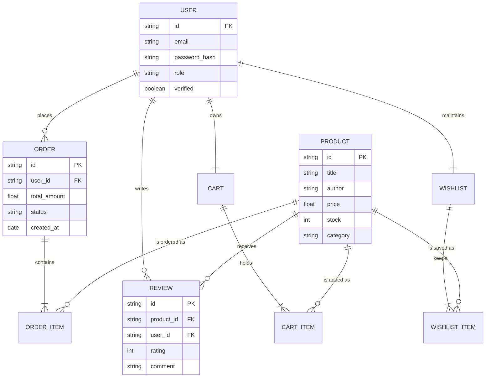

# BookNest-Backend

Welcome to the BookNest Backend repository! This project forms the core backend infrastructure for the BookNest e-commerce platform, built entirely using a modern Microservices Architecture.

## 🚀 Tech Stack

- **Core Framework**: Java 17, Spring Boot 3
- **Microservices Routing & Discovery**: Spring Cloud Gateway, Netflix Eureka
- **Database**: MongoDB (NoSQL) for high scalability
- **Message Broker**: RabbitMQ for asynchronous event-driven communication
- **Build Tool**: Maven
- **Quality Assurance**: JUnit 5, Mockito, SonarQube (Static Code Analysis)

## 🏗️ Microservices Architecture

The system is broken down into highly cohesive, loosely coupled microservices.

### Service Branches
Each service is isolated and maintained in its own feature branch for clean version control:

- **API Gateway**: `feature/api-gateway` (Routes external requests)
- **Discovery Server**: `feature/discovery-server` (Service registry using Eureka)
- **Auth User Service**: `feature/auth-user-service` (Authentication and User Management)
- **Product Service**: `feature/product-service` (Book inventory and product catalog)
- **Cart Service**: `feature/cart-service` (Shopping cart operations)
- **Order Service**: `feature/order-service` (Order processing and lifecycle)
- **Review Service**: `feature/review-service` (User reviews and ratings)
- **Wishlist Service**: `feature/wishlist-service` (User wishlists)
- **Notification Service**: `feature/notification-service` (Email & system notifications via RabbitMQ)

---

## 🔄 Architecture Flow Diagram

Below is the high-level architecture diagram showing how a client request flows through the BookNest backend ecosystem:



---

## 🗄️ Database Schema Diagram

Here is a simplified view of the domain entities and their relationships. Since we are using MongoDB, these represent aggregate roots.



## 🛠️ Getting Started

1. Clone the repository and switch to `dev` or `main`.
2. To work on a specific service, check out its branch:
   ```bash
   git checkout feature/<service-name>
   ```
3. Start the `Discovery Server` first, followed by the `API Gateway`, and then the individual microservices.
4. Run `docker-compose up` from the root to start local infrastructure like SonarQube and its PostgreSQL database.
